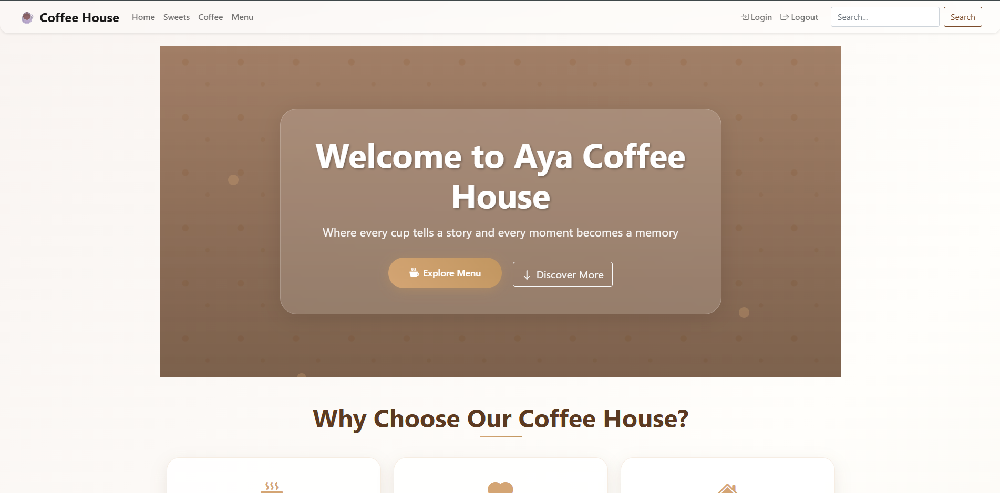
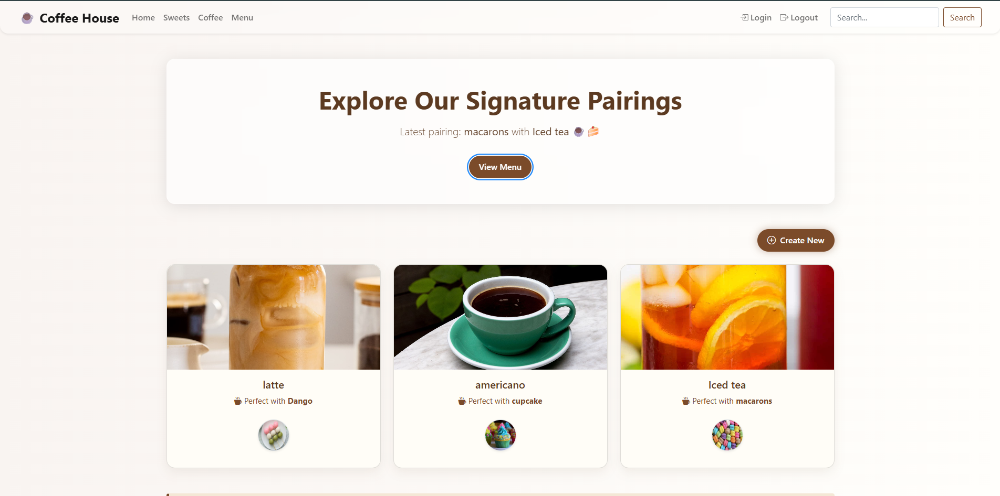
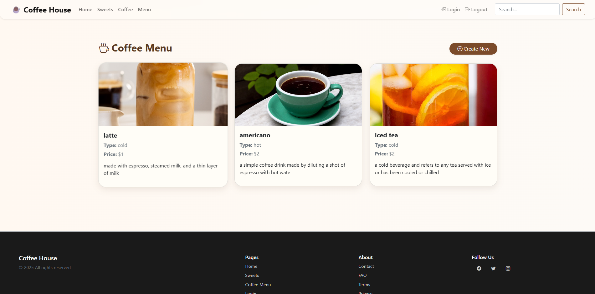
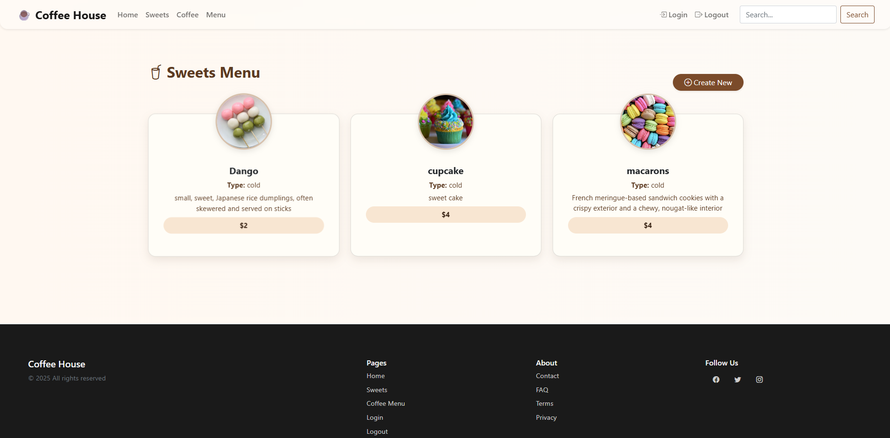
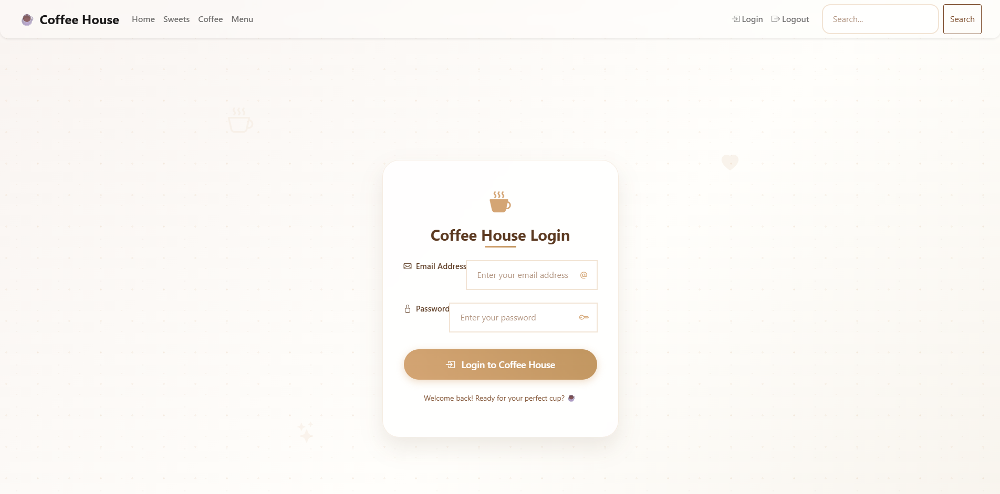
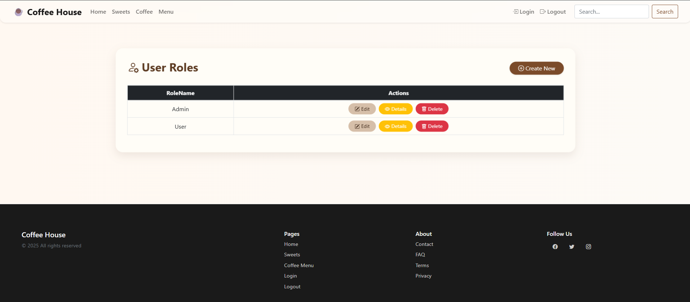

# ☕ Coffee House

A full-stack **ASP.NET Web Application** built with **C#** that simulates a real coffee shop system with customer and admin functionality.  
The system allows users to browse the menu, place orders, and administrators to manage products and users through a dedicated admin dashboard.

---

## 🚀 Features

### 👤 User Features
- Home page with coffee house information
- Menu page displaying all available items
- User login & authentication
- Browse products and prices

### 🛠 Admin Features
- Secure admin login
- Admin dashboard
- Add, update, and delete menu items
- Manage users
- View system data stored in database

### 🗄 Database
- Stores:
  - Users (Admin & Normal Users)
  - Menu items
  - Orders (if implemented)
- Fully connected to the ASP.NET backend

---

## 🧰 Technologies Used

| Layer | Technology |
|------|-----------|
| Backend | ASP.NET (C#) |
| Frontend | HTML, CSS, JavaScript |
| Database | SQL Server |
| Authentication | ASP.NET Login System |
| IDE | Visual Studio |

---

## 🖥 System Screenshots
### 🏠 Home Page

### 📋 Menu Page

### 🔐 Login Page

### 👤 User Dashboard

### 🛠 Admin Dashboard

### 🗄 Database / Management

